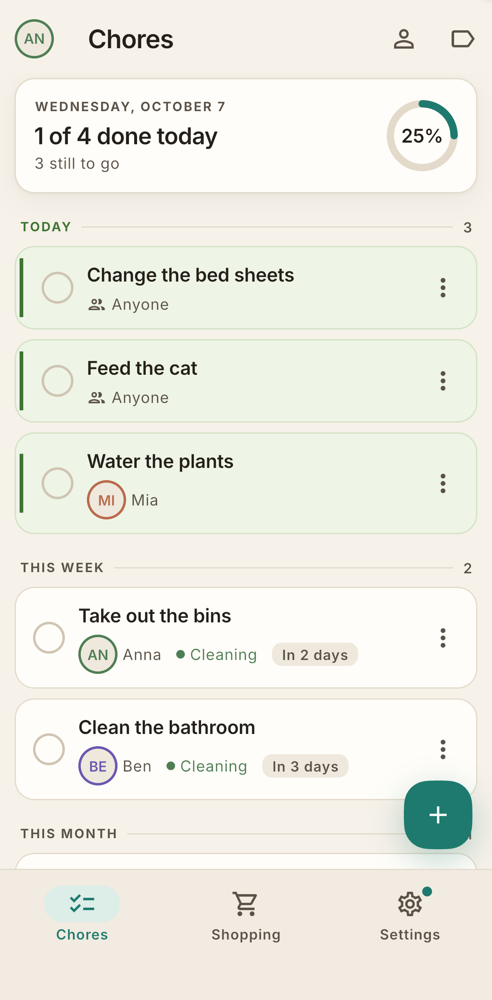
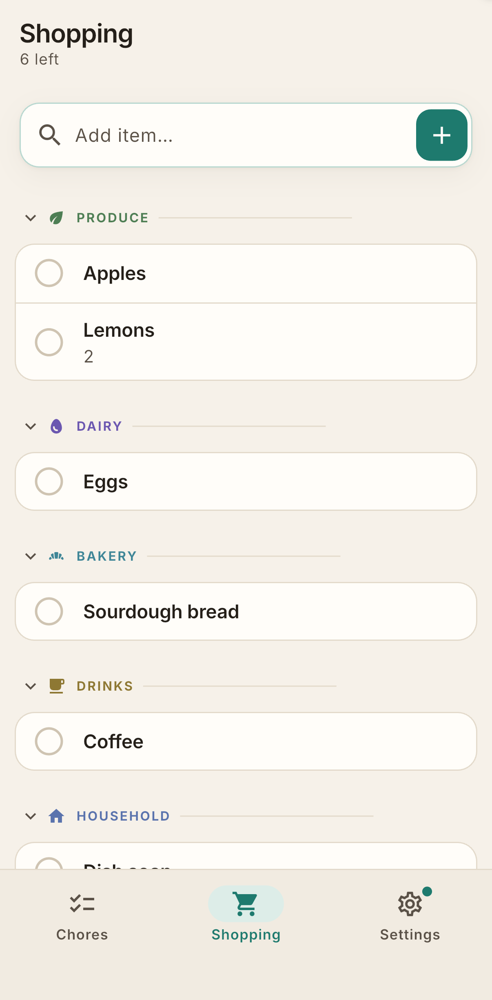

# Famdo — family chores and shopping, shared and fair

Famdo is a small, friendly app for a household: who does which chore when,
and what we need from the shop. It works completely offline on one phone,
and when you want to share it with the family you sign in once and everyone
sees the same lists.

Free and open source (MIT). No ads, no tracking, no account unless you choose
to sync.

<p align="center">
  
  &nbsp;&nbsp;
  
</p>

## What it does

**Chores**
- Repeating chores written as a sentence: *every 2 weeks on Tue, Fri*,
  *every month on the 1st Saturday*, or *3 days after it was last done*.
  A live preview shows the next dates before you save.
- Assign to one person, let people take turns in a fixed order, or leave it
  open for whoever gets to it. Covering for someone doesn't cost you your own
  turn, and you can hand today's turn to someone else when plans change.
- Tick it off, undo, skip, or pause a chore until a date (holidays). Reopen
  something you ticked by mistake. Everything you do can be taken back.
- The list shows what's overdue, due today, this week and later, with a
  progress card for the day. Filter to just your own chores.
- One calm daily summary notification, only when something is actually due,
  with optional per-chore reminders and quiet hours. No nagging.
- Chore history shows who did what over the last 30 days, in plain counts,
  never as a ranking.

**Shopping list**
- Type and go: "Milk, eggs, 2 bread" becomes three items with quantities.
  The app remembers what you buy and offers your staples when you focus the
  field, and it stops you adding the same thing twice.
- Items are grouped by aisle, groups collapse, and a tick moves an item into
  the cart. "Clear checked" after the checkout, with Undo.
- The header tells you how many items are left and when the list last synced,
  so you know in the shop whether the others' additions have arrived.

**Together**
- Start on one phone with no account. When you're ready, put the household
  online and share an invite code. Each family member picks their own name
  when they join.
- Changes sync in the background and keep working when the signal drops.
  Changes made offline are sent when you're back online, and the app tells
  you when something is still waiting.
- Leave a household, remove a member, or delete your account at any time.
  Deleting your account removes your email from the server; the household's
  history stays with the household.

**Yours**
- Local-first: the data lives on your phone. The optional sync server holds
  only what you chose to share. [PRIVACY.md](PRIVACY.md) spells out exactly
  what goes where.
- Export everything as a JSON file whenever you like.
- English and German, light and dark theme, large-text friendly, labelled for
  screen readers.

## Get it

**Android**
- Download the latest `famdo-vX.Y.Z.apk` from
  [GitHub Releases](https://github.com/igorzamyslov/chore-app/releases/latest)
  and open it on your phone (allow installs from your browser or file manager
  when Android asks).
- For automatic updates, add this repository in
  [Obtainium](https://github.com/ImranR98/Obtainium). An F-Droid listing is
  planned.

**iOS**
- Famdo is not in the App Store (open-source distribution only, no paid
  developer account). You can build and run it on your own iPhone with Xcode
  from this repository; see "For developers" below.

## Sharing with your family

1. Settings → Household → sign in with your email (you'll get a sign-in link).
2. Tap **Put my household online**. Your chores, members and list are
   uploaded under your account.
3. Tap **Invite a member** and share the code. The code is valid for seven
   days and the message includes a download link.
4. On the other phone, choose **Join my family's household** on the welcome
   screen, sign in, enter the code, and pick your name from the list (or
   "I'm new here").

Settings → About → **Technical details** shows which server the app syncs
with, the privacy notes, the source code and the open-source licences.

## Found a problem or want something?

Open an issue in this repository. Field feedback has shaped most of the app so
far; the triage notes under [docs/feedback/](docs/feedback/) show how earlier
rounds were handled.

If Famdo is useful to you, Settings → About → **Support the app** has Ko-fi
and PayPal links.

---

## For developers

Flutter (Android + iOS), Riverpod, drift/SQLite local-first, optional
Supabase sync, gen_l10n (EN template + DE), Maestro E2E. The product and
architecture design is in [DESIGN.md](DESIGN.md); binding specs for each
component live in [docs/specs/](docs/specs/); the backend setup is in
[docs/backend-supabase.md](docs/backend-supabase.md).

### Setup after cloning

```sh
flutter pub get
lefthook install   # activates the git hooks (brew install lefthook)
```

Run on a device or simulator with `flutter run`. Without `SUPABASE_URL` and
`SUPABASE_ANON_KEY` dart-defines the app runs fully offline (the sync UI
hides itself); see `docs/backend-supabase.md` for a local Supabase stack.

### Setup in a new `git worktree`

Run `pub get` there **before** anything else, `dart format` above all:

```sh
flutter pub get --enforce-lockfile
tool/check_formatter_config.sh   # confirms it worked
```

A fresh worktree has no `.dart_tool/`, and without it `dart format` **formats
with the wrong configuration and does not tell you**. It cannot resolve the
`package:very_good_analysis/...` include in
[analysis_options.yaml](analysis_options.yaml), so it loses that file's
`trailing_commas: preserve` and falls back to `automate`. It warns on stderr
only, and still exits 0. A bare `dart format .` then strips trailing commas and
rejoins multi-line calls across a large part of the tree — and **nothing can
detect that afterwards**, because `preserve` is stable on `automate`'s output,
so both the hook and CI's `dart format --set-exit-if-changed` pass on the
churn.

`tool/check_formatter_config.sh` answers "is my formatter config actually
resolving?" truthfully: it formats a fixture that comes out *differently* under
the two modes, rather than looking for `.dart_tool/` and hoping. Run it whenever
you are unsure — the pre-commit `format` job also runs it before formatting
anything.

### Checks

Every commit runs (via [lefthook.yml](lefthook.yml)):

| Check | Command |
|---|---|
| Formatter config | `tool/check_formatter_config.sh` (guards the next row) |
| Format | `dart format` (auto-fixes staged files) |
| Analyze | `flutter analyze --fatal-infos --fatal-warnings` |
| Tests | `flutter test` |
| Lockfile | `dart pub get --enforce-lockfile --offline` |

CI ([.github/workflows/ci.yml](.github/workflows/ci.yml)) runs the same
checks — keep them in sync. Pull requests also run the Maestro E2E suite on
Android ([e2e/README.md](e2e/README.md) has the flow-authoring rules) and,
when the database contract changes, pgTAP plus a live smoke test against a
throwaway Supabase stack.

Run tests locally with the same defines CI uses, so the suite stays offline:

```sh
flutter test --dart-define=SUPABASE_URL= --dart-define=SUPABASE_ANON_KEY=
```

### Releasing

Bump `version:` in `pubspec.yaml`, add `fastlane/metadata/android/*/changelogs/<build>.txt`,
merge, then push a tag `vX.Y.Z` that matches the version. The Release
workflow checks the tag against `pubspec.yaml`, builds a signed APK, verifies
its manifest and publishes it to GitHub Releases.

## License

MIT — see [LICENSE](LICENSE).
